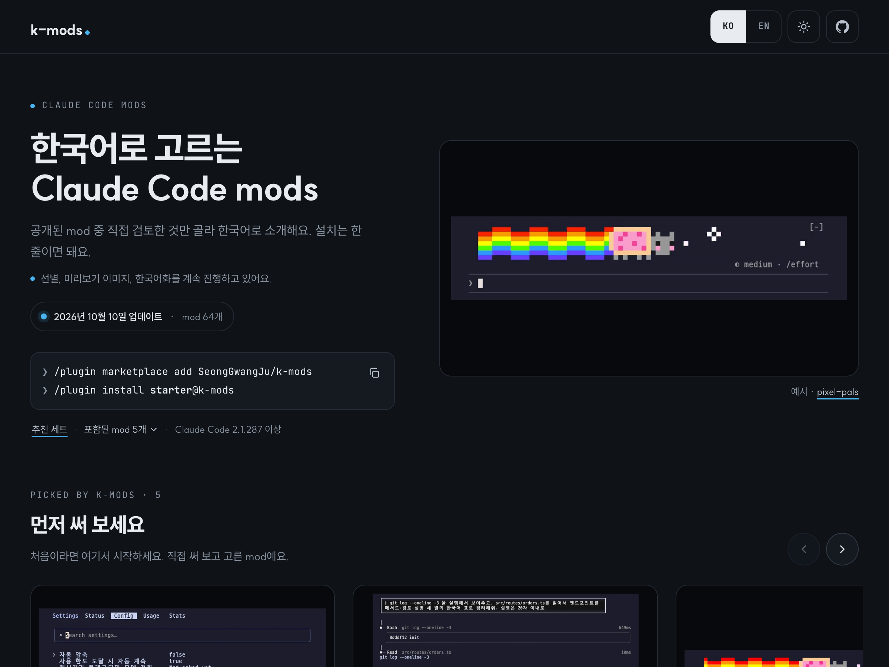

# k-mods

<p align="center"><a href="README.md">한국어</a> · <b>English</b></p>

[](https://code.claude.com/docs/en/plugins/mods/overview)
[](https://github.com/SeongGwangJu/k-mods)
[](LICENSE)
[](https://seonggwangju.github.io/k-mods/en/)

<!-- HERO: 데모 GIF가 정해지면 아래 줄의 주석을 풀어요

-->

A reviewed, installable catalog of **Claude Code mods**, curated in Korea.
Every external mod is pinned to the exact commit we reviewed and labeled with what it can do on your machine.

(Curation, preview images and Korean localization are ongoing…)

Every mod is listed below, but they are easier to browse with pictures on the [website](https://seonggwangju.github.io/k-mods/en/).

<a href="https://seonggwangju.github.io/k-mods/en/"></a>

## Install

Needs Claude Code 2.1.287 or later (`claude --version`).

```
/plugin marketplace add SeongGwangJu/k-mods
```

Pick mods in `/plugin`, or install the ⭐ mods below at once with `/plugin install starter@k-mods`.
Descriptions in `/plugin` are in Korean; this page and each mod's source link are in English.

## Why k-mods

1. **Pinned, reviewed commits.** External mods install straight from the author's repository, but only at the commit we reviewed. Updates are re-reviewed.
2. **Access labels.** Mods run unsandboxed with your permissions. We statically analyze each one (`claude plugin validate`) and label network access, programs run, file writes, model calls, tool-call gating and more.
3. **Fixes for CJK users.** Patched editions fix bugs that only show up with wide characters (e.g. cut-off Korean tables), with every change listed in the mod's `CHANGES-KO.md`.
4. **Respect for authors.** No code is copied for external mods. Unlicensed mods are not listed without permission, and takedown requests are honored right away.

## Catalog

<!-- BEGIN:catalog -->
### 🇰🇷 Korean UI

| mod | What it does | Source |
| --- | --- | --- |
| [**ko-ui**](docs/mods/ko-ui.md) ⭐ | Dictionary-based mod that shows Claude Code's slash-command descriptions, /config rows, and some UI text in Korean. | [moduvoice](https://github.com/moduvoice) |

### 🎨 Themes

| mod | What it does | Source |
| --- | --- | --- |
| [**skins**](docs/mods/skins.md) ⭐ | Themed cards for tool rows, tables, code and shell output; fixes CJK table widths and missing shell output in the terminal | 🔧 [hellosverre](https://github.com/hellosverre) · patched |
| [**gfm-render**](docs/mods/gfm-render.md) | Renders GitHub Flavored Markdown alerts, task lists, strikethrough and Mermaid diagrams in the Claude Code transcript. | [briangtn](https://github.com/briangtn) |
| [**prismantis**](docs/mods/prismantis.md) | Colorful, themeable rendering for Claude Code replies across 15 themes: tables, code, diagrams, charts and tool rows, with copy buttons. | [Nahum Litvin](https://github.com/NahumLitvin) |

### 🐾 Animation & fun

| mod | What it does | Source |
| --- | --- | --- |
| [**pixel-pals**](docs/mods/pixel-pals.md) ⭐ | Pixel pals cross the band above the prompt while Claude works: Nyan Cat, Clawd, a shoot-em-up and more. Six curated scenes plus clawd-tales' Clawd story, in Korean | 🔧 hoobnn · plaxagoras · patched |
| [**cc-arcade**](docs/mods/cc-arcade.md) | Nine terminal mini-games above the prompt (snake, Tetris, 2048, and more), plus a pet that grows as Claude works. | [Seza Akgün](https://github.com/sezaakgun) |
| [**clawd-spinner**](docs/mods/clawd-spinner.md) | Clawd acts out the spinner's word above it—cooking, dancing, pacing—with a scene for every one of 189 spinner words, no model calls. | [Sai Rudra](https://github.com/saiharsha03) |
| [**clawd-tales**](docs/mods/clawd-tales.md) | A pixel Clawd acts out every tool call above the prompt, with helper characters for each subagent—terminal-first, no model calls. | [plaxagoras](https://github.com/plaxagoras) |
| [**combo-meter**](docs/mods/combo-meter.md) | A fighting-game combo meter: every clean tool call is a hit, every error breaks the chain. D to SSS ranks, pixel-art visuals. | [Sarthak Bhatore](https://github.com/sarthak2511) |
| [**diff-invaders**](docs/mods/diff-invaders.md) | Space Invaders where every wave is made from the lines Claude's last Edit/Write actually added; zero tokens, played above the prompt. | [claude-code-templates](https://www.aitmpl.com) |
| [**reels**](docs/mods/reels.md) | Plays YouTube Shorts in a terminal pane while Claude works and pauses when it's done. Nothing starts until you run /reels. | [Hamza Zafar](https://github.com/hamzafer) |
| [**tool-defense**](docs/mods/tool-defense.md) | A tower defense where every enemy is one of Claude's real tool calls (Bash, Edit, web/MCP, Agent); zero tokens, played above the prompt. | [claude-code-templates](https://www.aitmpl.com) |

### 📊 Status lines

| mod | What it does | Source |
| --- | --- | --- |
| [**ctx-strip**](docs/mods/ctx-strip.md) ⭐ | A stacked bar above the prompt showing what fills your context window, plus a live line for running subagents | 🇰🇷 k-mods |
| [**status-ko**](docs/mods/status-ko.md) | Spinner shows what Claude is doing now in Korean; the turn footer becomes one line of model, time, tools and cache hit | 🇰🇷 k-mods |
| [**agent-radar**](docs/mods/agent-radar.md) | Shows one live line per running subagent above the prompt: time, tool count, current action. /radar lists every agent and its messages. | [Hamza Zafar](https://github.com/hamzafer) |
| [**browser-lanes**](docs/mods/browser-lanes.md) | Shows whether this session has a Playwright browser and who holds it, and makes subagents in the same session take turns using it. | [Hamza Zafar](https://github.com/hamzafer) |
| [**cache-panel**](docs/mods/cache-panel.md) | A passive 50-minute prompt-cache reminder with keep-warm, ping-once or compact choices, each shown with a live cost estimate. | [Dustin Yuchen Teng](https://github.com/danyuchn) |
| [**context-bar**](docs/mods/context-bar.md) | Your context window as a stacked bar above the prompt, colored per category as /context does, with token counts and the compaction point. | [Hamza Zafar](https://github.com/hamzafer) |
| [**flightdeck**](docs/mods/flightdeck.md) | A live terminal dashboard: model vitals, cost/context, an on-call architect, permission checks and subagent cards from real session events. | [Stephen Casella](https://github.com/scasella) |
| [**hud**](docs/mods/hud.md) | claude-hud 0.10.0 as a mod: model, project, git, context, usage, tools, agents, todos, alerts, budget, history, task summary, themes. | [hoobnn](https://github.com/hoobnn) |
| [**mod-usage**](docs/mods/mod-usage.md) | Shows context, 5-hour, and 7-day usage as gradient bars above the prompt. Desktop/VS Code only; 12 languages supported, not Korean yet. | [Jack Chiang](https://github.com/jack21) |
| [**pr-pulse**](docs/mods/pr-pulse.md) | Live GitHub PR status in Claude Code: merge readiness, CI checks, review comments and your review queue, in a collapsible band and panes. | [Gerric Chaplin](https://github.com/gerricchaplin) |
| [**prompt-cache-control**](docs/mods/prompt-cache-control.md) | Shows how much of each request's prompt the cache served vs wrote, counts down to expiry, and suggests /compact or /clear before it lapses. | [claude-code-templates](https://www.aitmpl.com) |
| [**receipt**](docs/mods/receipt.md) | What each turn did, in a band above the prompt: files/lines changed, commands and failures, reads, subagents; a toast when the model loops. | [hoobnn](https://github.com/hoobnn) |
| [**review-watch**](docs/mods/review-watch.md) | Shows one live line per running code review (a codex review command, or a review subagent): model, target, elapsed time, latest output. | [Hamza Zafar](https://github.com/hamzafer) |
| [**statuspane**](docs/mods/statuspane.md) | A status card above the prompt: model, effort, context, 5h/week limits, cost, directory and branch, with optional GitHub CI rows. | [Anji Xu](https://github.com/xuanji86) |
| [**taxi-meter**](docs/mods/taxi-meter.md) | A taxi-meter panel above the prompt: session cost, model/tier, 5-hour and weekly limits with reset time, via /meter and /receipt. | [개발동생 (devbrothers)](https://github.com/devbrother2024) |
| [**todo-bar**](docs/mods/todo-bar.md) | Shows the task list's progress in a band above the prompt, read from the todo and task tools' own calls: no tool, no prompt, no tokens. | [hoobnn](https://github.com/hoobnn) |
| [**token-weather**](docs/mods/token-weather.md) | A live weather-style forecast of the context window above the prompt, with an icon, percent, and a bar chart of recent turns. | [Claude Code DevRel](https://github.com/anthropics) |
| [**ts-band**](docs/mods/ts-band.md) | Shows Tailscale nodes' state in a band above the prompt, with a toast when a node comes up or goes down. | [hoobnn](https://github.com/hoobnn) |
| [**usage-band-pawandeep**](docs/mods/usage-band-pawandeep.md) | Always-visible 5-hour and weekly Claude usage percentages with a reset countdown above the prompt, plus new-chat and GitHub push buttons. | Pawandeep |

### 🧰 Tools

| mod | What it does | Source |
| --- | --- | --- |
| [**mod-store**](docs/mods/mod-store.md) ⭐ | Type /k-mods to browse this catalog in a pane and install or remove mods with one key | 🇰🇷 k-mods |
| [**memo-pad**](docs/mods/memo-pad.md) | Jot down your next instructions while Claude works, then drop one into the prompt with a button | 🇰🇷 k-mods |
| [**agent-flow**](docs/mods/agent-flow.md) | A side pane showing the main loop and every subagent as a live tree, with the context handed down and the answer handed back for each. | [claude-code-templates](https://www.aitmpl.com) |
| [**agent-quick-menu**](docs/mods/agent-quick-menu.md) | A pane and prompt band listing every installed plugin's commands and settings, with favourites and Claude Code's own /config rows. | [dasganni](https://github.com/dasganni) |
| [**image-view**](docs/mods/image-view.md) | See the images you paste into Claude Code: thumbnails above the prompt instead of bare [Image #1] tags. | [gggodlin](https://github.com/GGGODLIN) |
| [**now-playing**](docs/mods/now-playing.md) | Shows Spotify's current track, progress, and synced lyrics above the prompt on macOS, with transport buttons and /music commands. | [Hamza Zafar](https://github.com/hamzafer) |
| [**paste-view**](docs/mods/paste-view.md) | See what you paste into Claude Code: image thumbnails and long-text previews above the prompt instead of bare placeholder tags. | [Clément Décou](https://github.com/Amorfx) |
| [**pixel-player**](docs/mods/pixel-player.md) | A pixel-art music player pane that streams your playlist through mpv, with a character that reacts to the music. | [chrisluo5311](https://github.com/chrisluo5311) |
| [**prompt-rail**](docs/mods/prompt-rail.md) | A rail of your session's prompts beside the transcript or above the prompt; hover to read one, click to jump to it. | [oikon48](https://github.com/oikon48) |
| [**replay-theater**](docs/mods/replay-theater.md) | Step through the file edits Claude made in the last turn, one diff at a time, in a pane. | [Claude Code DevRel](https://github.com/anthropics) |
| [**session-wrapped**](docs/mods/session-wrapped.md) | Spotify-Wrapped-style recap for a Claude Code session: run /wrapped for an animated stat reveal, saved as a shareable PNG on your Desktop. | [OneWave AI](https://www.onewave-ai.com) |
| [**taxi-blackbox**](docs/mods/taxi-blackbox.md) | Records tool calls like a car's black box; replay the moments before an error or denial with /blackbox. Tokens and passwords are masked. | [개발동생 (devbrothers)](https://github.com/devbrother2024) |
| [**taxi-navi**](docs/mods/taxi-navi.md) | Shows your todo list like a car navigation: progress path, next-step guidance, 'recalculating' on plan changes, an arrival announcement. | [개발동생 (devbrothers)](https://github.com/devbrother2024) |

### ⚡ Automation

| mod | What it does | Source |
| --- | --- | --- |
| [**done-alarm**](docs/mods/done-alarm.md) | Notifies you on your Mac, out loud, or on your phone (ntfy, Telegram, Slack, Discord) when a long turn ends or Claude needs you | 🇰🇷 k-mods |
| [**agent-compact-advisor**](docs/mods/agent-compact-advisor.md) | Scores 0-100 how ready your session is to /compact, and adds a template to every compaction that preserves goals, decisions and leftovers. | [apolenkov](https://github.com/apolenkov) |
| [**auto-handoff**](docs/mods/auto-handoff.md) | Hands a long session off to a fresh one with a Haiku-written brief instead of auto-compacting, with an optional viewer page for the brief. | [Alex Hillman](https://github.com/alexknowshtml) |
| [**ctx-handoff**](docs/mods/ctx-handoff.md) | Auto handoff to a fresh conversation when context hits a threshold, with idle cache refresh and background project notes while you're away. | [cablate](https://github.com/cablate) |
| [**jev-skill-suggestion**](docs/mods/jev-skill-suggestion.md) | Picks one skill per prompt and loads it while hiding the listing from context; uses TypeSafe's Jev with a key, else Claude's classifier. | [claude-code-templates](https://www.aitmpl.com) |
| [**next-steps**](docs/mods/next-steps.md) | After each turn, suggests 2 or 3 likely next prompts above the input box; pressing 1, 2, or 3 drafts one into the empty prompt, 0 dismisses. | [Hamza Zafar](https://github.com/hamzafer) |
| [**switchboard**](docs/mods/switchboard.md) | Picks Haiku, Sonnet, or Opus for each subagent before it starts (an external routing API, or local rules), showing each pick and its cost. | [Hamza Zafar](https://github.com/hamzafer) |
| [**where-am-i**](docs/mods/where-am-i.md) | A live recap above the prompt (goal, doing now, waiting on you, next), with /where for a longer bullet-point summary. | [Hamza Zafar](https://github.com/hamzafer) |

### 🛡️ Guards

| mod | What it does | Source |
| --- | --- | --- |
| [**streamer-mode**](docs/mods/streamer-mode.md) | Hides API keys, emails, phone numbers and Korean ID numbers on screen while you stream or share; Claude still sees the originals | 🇰🇷 k-mods |
| [**blast-radius-ko**](docs/mods/blast-radius-ko.md) | Holds irreversible commands (rm -rf, force push, DB resets, volume prunes) and shows what they would change before asking | 🔧 [Anthropic](https://github.com/anthropics) · patched |
| [**secret-redactor**](docs/mods/secret-redactor.md) | Redacts API keys, JWTs, private keys and DB strings from tool results before the model reads them; blocks placeholder reuse in Bash. | [claude-code-templates](https://www.aitmpl.com) |
| [**secret-vault**](docs/mods/secret-vault.md) | Hides pasted or tool-read secrets, emails and IPs with stable placeholders, restoring real values only right before a tool runs. | [Ray Amjad](https://github.com/ray-amjad) |
| [**taxi-speedcam**](docs/mods/taxi-speedcam.md) | A speed camera for dangerous Bash commands: force push, rm -rf, DB drops, discarding changes, prod deploys. Asks first, or always blocks. | [개발동생 (devbrothers)](https://github.com/devbrother2024) |

### 🔗 Integrations

| mod | What it does | Source |
| --- | --- | --- |
| [**cc-pr-tracker**](docs/mods/cc-pr-tracker.md) | Watches GitHub PRs from your session—merge state, review, and required checks above the prompt—with alerts when they change. | [Seza Akgün](https://github.com/sezaakgun) |
| [**github-issues**](docs/mods/github-issues.md) | A side pane of a repository's GitHub issues as cards, with search, label filters and a button to hand one to Claude. | [Marco Carnevali](https://github.com/MarcoCarnevali) |
| [**glance**](docs/mods/glance.md) | One line above the prompt for what needs you: the next meeting, PRs awaiting review, in-progress Linear issues, and recent Slack DMs. | [Hamza Zafar](https://github.com/hamzafer) |
| [**linear-board**](docs/mods/linear-board.md) | Your Linear projects, milestones and issues in a pane; plan, execute or product buttons send a ready prompt into the session. | [linear-mod contributors](https://github.com/SaharCarmel/linear-mod) |
| [**linear-tickets**](docs/mods/linear-tickets.md) | Shows your assigned Linear tickets in a pane; click one to load it into the session, read details, comment, or change status and priority. | [rjohnt](https://github.com/rjohnt) |
| [**terminal-browser**](docs/mods/terminal-browser.md) | Renders a real browser inside Claude Code's terminal so you/the agent can preview web pages; needs the separate terminal-browser app. | [zenbu-labs](https://github.com/zenbu-labs) |
| [**vercel-deploy-status**](docs/mods/vercel-deploy-status.md) | Pins the linked Vercel project's deploy queue above the prompt, one line per deploy with phase and elapsed time. | [Ray Amjad](https://github.com/ray-amjad) |

### 📦 Bundles

| mod | What it does | Source |
| --- | --- | --- |
| [**korean-pack**](docs/mods/korean-pack.md) | One install for a Korean Claude Code: menu, settings and status-line translation (ko-ui). status-ko is left out because it overwrites the same lines as ko-ui | 📦 bundle |
| [**starter**](docs/mods/starter.md) | The k-mods starter set: ko-ui, skins, pixel-pals, ctx-strip and mod-store in one install | 📦 bundle |
| [**taxi-pack**](docs/mods/taxi-pack.md) | Claude Code as a taxi ride: meter (cost and limits), navigation (todo route), speed camera (risky-command check) and dashcam (tool-call recorder) in one install | 📦 bundle |
<!-- END:catalog -->

## Contributing

Suggest a mod with an [issue](https://github.com/SeongGwangJu/k-mods/issues/new?template=suggest-mod.yml), or add one `registry/<name>.json` file in a pull request. CI validates the install, runs the static analysis and checks the license. See [CONTRIBUTING.md](CONTRIBUTING.md) (Korean, but the registry schema in `registry/_schema.json` is self-describing).

## License

The catalog, scripts, docs and k-mods original mods are [MIT](LICENSE). Patched editions keep their upstream licenses ([NOTICE](NOTICE.md)); external mods are under their own licenses. Not affiliated with Anthropic.
