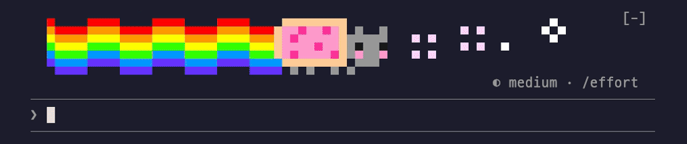

# pixel-pals (픽셀 친구들)

Claude가 일하는 동안 입력창 위에 냥캣·Clawd·썬더 같은 픽셀 친구들이 지나가요. 원작 두 mod에서 장면을 골라 합치고 한국어로 옮긴 k-mods 수정판이에요.



## 설치

```
/plugin marketplace add SeongGwangJu/k-mods
/plugin install pixel-pals@k-mods
```

## 쓰는 법

설치하면 바로 동작해요. Claude가 일하는 동안 입력창 위 띠에 장면이 흘러가고, 턴이 끝나면 짧은 피날레가 나와요. 테마는 턴마다 아래 7가지 중 하나로 바뀌어요.

| 테마 | 모습 |
| --- | --- |
| `nyan` | 무지개를 끌고 날아가는 냥캣 |
| `clawd` | Claude 마스코트 Clawd가 블록을 쌓아요 |
| `thunder` | 우주선이 적을 맞히는 슈팅 게임 |
| `chomp` | 점을 먹으며 유령을 쫓는 동그라미 |
| `sparky` | 번개 꼬리 생쥐 |
| `bluecat` | 주머니에서 도구를 꺼내는 파란 고양이 로봇 |
| `tales` | clawd-tales의 Clawd 이야기. 도구 호출마다 몸짓과 한 줄 캡션, 서브에이전트 동료, 컨텍스트에 따른 날씨 |

- `/pals`: 지금 테마와 펫 상태, 사용법
- `/pals <테마>` / `/pals random`: 테마 고르기 (`random`은 턴마다 새로)
- `/pals off` / `on`: 애니메이션 끄기·켜기. `stage off`·`on`은 장면 띠만, `companion on`은 입력창 위 펫 줄
- `/pals preview <테마>`: 8초 미리 보기 (`tales`는 `/tales demo`로)
- `/tales demo`: Clawd 이야기 45초 데모. `/tales hat <이름>`·`face <이름>`·`scarf on|off`로 꾸미고, `calm`은 1초에 한 번만 움직여요

## 설정 (`/config` 또는 `/plugin configure pixel-pals@k-mods`)

| 설정 | 기본값 | 설명 |
| --- | --- | --- |
| 테마 | `random` | 위 7가지 중 하나, 또는 턴마다 새로 |
| 장면 띠 | 켜짐 | 모델이 일하는 동안 입력창 위 장면 |
| 피날레 | 켜짐 | 턴이 끝나면 걸린 시간과 축하 |
| 펫 | 꺼짐 | 입력창 위 한 줄 펫. 턴마다 레벨이 올라요 |
| 움직임 줄이기 | 꺼짐 | 장면과 펫을 정지 그림으로 |
| 언어 | `ko` | 응답·피날레·Clawd 이야기 캡션의 언어 (Clawd 이야기는 한국어·영어만) |

## 원본과 다른 점

| | 원본 | pixel-pals |
| --- | --- | --- |
| 구성 | spinner(hoobnn), clawd-tales(plaxagoras) 따로 | 한 mod. clawd-tales는 `tales` 테마 |
| 테마 | spinner 15종 + audio | 6종 엄선 + `tales` |
| `random` | 세션마다, 14종 중 | 턴마다, 7종 중 |
| 언어 | 자동 / 영어(clawd-tales) | 한국어 기본, Clawd 이야기 캡션도 한국어 |
| 명령 | `/spinner`, `/tales` | `/pals`, `/tales` |
| 펫 줄·하단 버튼·줄 앞 마스코트 | 켜짐 | 꺼짐 (`/config`에서 켤 수 있어요) |
| audio 테마(swiftc로 소리 읽기) | 있음 | 없음 |
| hud(hoobnn) 연동 | 있음 | 없음 |

자세한 내역은 [CHANGES-KO.md](CHANGES-KO.md)에 있어요.

## 어떻게 동작하나요

- **턴이 시작할 때**: `random`이면 7종 중 테마를 새로 골라요.
- **도구를 부를 때·확인을 기다릴 때**: 펫과 Clawd가 지금 하는 일에 맞춰 몸짓을 바꿔요. 지켜보기만 하고 도구 호출을 막거나 바꾸지 않아요.
- **입력창 위를 그릴 때**: 테마가 `tales`면 clawd-tales의 무대가, 아니면 장면 띠가 그려요. 둘이 한 번에 그리지 않아요.
- **턴이 끝날 때**: 피날레를 잠깐 보여주고 펫이 경험치를 얻어요.

## 권한 (이 mod가 내 컴퓨터에서 하는 일)

화면을 그리고, 이 플러그인 전용 저장소(`$.store`)에 펫 상태와 Clawd의 모자·성장 기록을 저장해요. 세션의 컨텍스트·사용량 수치와 실행 중인 서브에이전트 목록을 읽어 날씨와 동료로 보여줘요. 네트워크, 모델 호출, 프로그램 실행은 없어요.

## 한계

- 장면은 터미널에서만 보여요. 데스크톱 앱에서는 `tales` 테마일 때만 띠가 그려져요.
- `/` 명령이나 `@` 파일 선택 창이 열리면 장면 띠는 잠깐 비켜요.
- nyan·chomp·sparky·bluecat은 원작자가 픽셀 오마주라고 부른 장면이고, Clawd는 Anthropic의 마스코트예요. 비공식 팬 작품이에요.
- 원본 spinner나 clawd-tales와 같이 켜면 띠가 겹쳐 보여요.

## 출처·라이선스

- 장면·펫: [hoobnn](https://github.com/hoobnn)의 [spinner](https://github.com/hoobnn/hoobnn-agent-mods/tree/8fb6f67cad9fd023cc7c06b7923518b4bbc45aea/claude-code/spinner) (커밋 `8fb6f67`, MIT). [LICENSE](LICENSE)
- `tales` 테마: [plaxagoras](https://github.com/plaxagoras)의 [clawd-tales](https://github.com/plaxagoras/clawd-tales/tree/89c7f95b4d4faf480a6ee200e92c3e6df34d1432) (커밋 `89c7f95`, MIT). [LICENSE-clawd-tales](LICENSE-clawd-tales)
- Clawd 걷기·환호 그림과 기본 팔레트: [Claude Fables](https://github.com/henrik-thevibe/Claude-Fables) (henrik-thevibe, MIT). [NOTICE](NOTICE)

원작자들께 감사드려요. 원본 저작권 표기와 라이선스는 위 파일에 그대로 뒀어요.

테스트한 Claude Code 버전: 2.1.296
